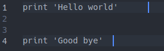
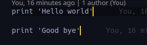

# Whitespace Linter

> Basic linter that detects and formats trailing whitespace and extra empty lines.

## Features

- Detects excessive whitespace in your file.
- Allows you to fix detected errors.

## Built With

- Ruby
- Rspec

## Code examples

### Bad code



### Good code



## Prerequisites

- Ruby

## Install

```bash
gem install ws_lint
```

## Usage

```bash
ws_lint /path/to/file
```

## Testing

```bash
bundle exec rspec
```
## Author

👤 **Meron Ogbai**

- Github: [@meronokbay](https://github.com/meronokbay)
- Twitter: [@MeronDev](https://twitter.com/MeronDev)
- Linkedin: [Meron Ogbai](https://linkedin.com/in/meron-ogbai/)

## 🤝 Contributing

Contributions, issues, and feature requests are welcome!

## Show your support

Give a ⭐️ if you like this project!

## 📝 License

This project is [MIT](lic.url) licensed.
