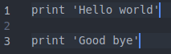

# Whitespace Linter

> Basic linter that detects and formats trailing whitespace and extra empty lines.

This linter is built using Ruby and implements OOP to detect and format whitespace and empty lines in your code.

## Built With

- Ruby
- Rspec

## Code examples

### Bad code

### Good code

## Getting Started

To get a local copy up and running follow these simple steps.

### Prerequisites

- Ruby
- Git

### Install

- Clone the repo to your local machine using git.
- Navigate to the projects directory.
- Execute `bundle install` to install the necessary gems (dependencies).

### Usage

- Execute `bin/main.rb /path/to/file` to lint the file that contains your code.

### Run tests

- Execute `rspec` to run the unit tests.

## Author

👤 **Meron Ogbai**

- Github: [@meronokbay](https://github.com/meronokbay)
- Twitter: [@MeronDev](https://twitter.com/MeronDev)
- Linkedin: [linkedin](https://linkedin.com/in/meron-ogbai/)

## 🤝 Contributing

Contributions, issues, and feature requests are welcome!

## Show your support

Give a ⭐️ if you like this project!

## 📝 License

This project is [MIT](lic.url) licensed.
